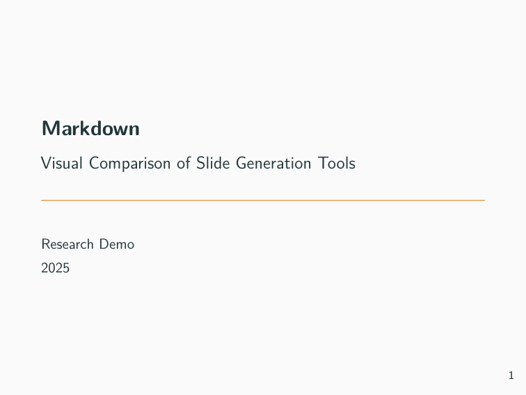
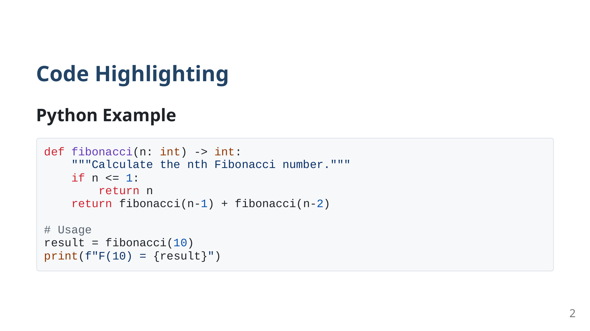
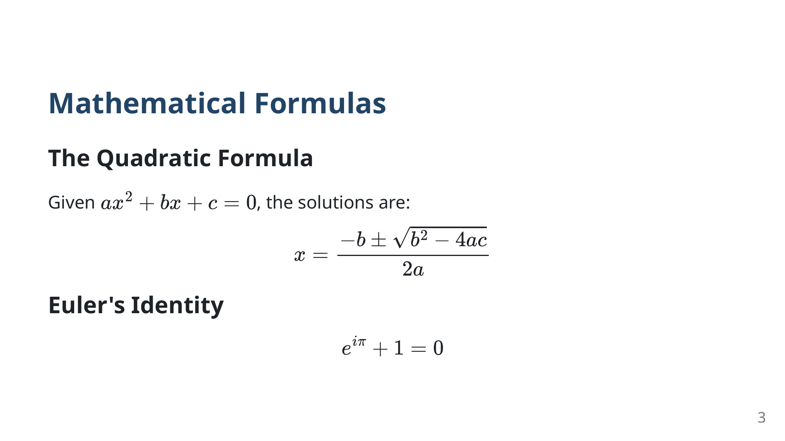
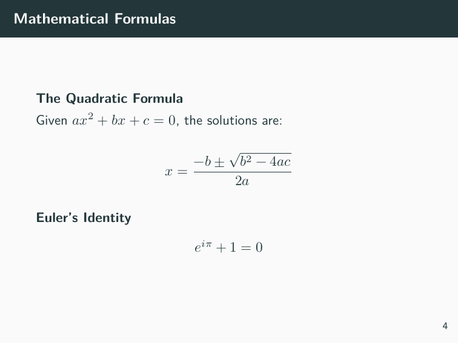

<h1 align="center">md-slides-tools</h1>

<p align="center">
  <strong>Turn Markdown into beautiful slides with one command</strong>
</p>

<p align="center">
  <a href="#quick-start">Quick Start</a> •
  <a href="#visual-comparison">Examples</a> •
  <a href="https://zl190.github.io/md-slides-tools/">Live Demo</a> •
  <a href="docs/report-research-zh.md">Research Report</a>
</p>

<p align="center">
  
  
  
  
</p>

<p align="center">
  
  
</p>

---

## Why This Tool?

Writing slides in PowerPoint is slow. This toolkit lets you:

- **Write in Markdown** → Focus on content, not formatting
- **Generate PDF, PPTX, HTML** → One source, multiple outputs
- **Use with AI/LLM** → Claude/GPT can write slides for you

## Quick Start

```bash
# Install Marp CLI
npm install -g @marp-team/marp-cli

# Convert markdown to slides
marp your-slides.md -o slides.pdf      # PDF
marp your-slides.md -o slides.pptx     # PowerPoint
marp your-slides.md -o slides.html     # Web
```

That's it. Write markdown, get slides.

## Tool Comparison

| Tool | Formats | LLM Score | Use Case |
|------|---------|:---------:|----------|
| **[Marp](https://marp.app/)** | PDF, PPTX, HTML | ⭐⭐⭐⭐⭐ | General purpose, best balance |
| **[python-pptx](https://python-pptx.readthedocs.io/)** | PPTX | ⭐⭐⭐⭐⭐ | Fine control, templates |
| **[reveal.js](https://revealjs.com/)** | HTML | ⭐⭐⭐⭐ | Web presentations |
| **[Pandoc Beamer](https://pandoc.org/)** | PDF | ⭐⭐⭐⭐ | Academic, math-heavy |

> **Recommendation:** Start with **Marp** for most use cases.

## Visual Comparison

### Cover Pages

| Marp (Gaia Theme) | Beamer (Metropolis) |
|:-----------------:|:-------------------:|
|  |  |

### Code Highlighting

| Marp | Beamer |
|:----:|:------:|
|  |  |

### Math Rendering

| Marp (MathJax) | Beamer (LaTeX) |
|:--------------:|:--------------:|
|  |  |

## Example Markdown

```markdown
---
marp: true
theme: gaia
---

# My Presentation

## Slide 2: Code

​```python
def hello():
    print("Hello, World!")
​```

## Slide 3: Math

$$E = mc^2$$
```

## Advanced Usage

<details>
<summary><strong>Pandoc Beamer (Academic/LaTeX)</strong></summary>

```bash
# Install
sudo apt install pandoc texlive-xetex

# Generate PDF with themes
pandoc slides.md -t beamer -V theme:metropolis --pdf-engine=xelatex -o slides.pdf
```

Best for: Math formulas, academic papers, LaTeX users.

</details>

<details>
<summary><strong>python-pptx (Programmatic PPTX)</strong></summary>

```bash
pip install python-pptx
python samples/test_python_pptx.py
```

Best for: Template-based generation, enterprise workflows, LLM integration.

</details>

<details>
<summary><strong>reveal.js (Web Presentations)</strong></summary>

```bash
pandoc slides.md -t revealjs -s -o slides.html -V theme=moon
```

Best for: Interactive web presentations, speaker notes.

</details>

## Project Structure

```
docs/               # Sample markdown files & research
samples/            # Code examples (python-pptx)
assets/             # Comparison screenshots
.claude/skills/     # Claude Code integration
```

## Claude Code Integration

This repo includes a Claude Code skill for AI-assisted slide generation:

```bash
# In Claude Code, use:
/md-slides "Create a 5-slide presentation about Python async"
```

## License

MIT

---

<p align="center">
  <a href="https://zl190.github.io/md-slides-tools/">View Live Demo</a> •
  <a href="docs/report-research-zh.md">Read Full Research (中文)</a>
</p>
