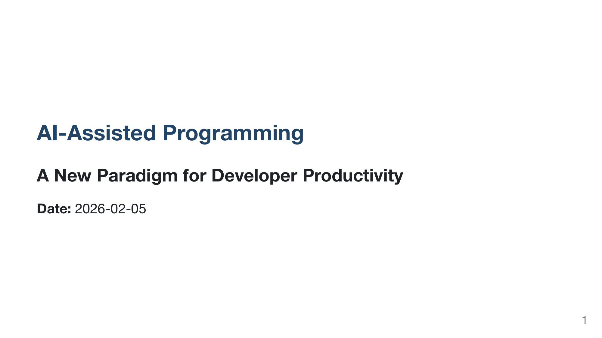
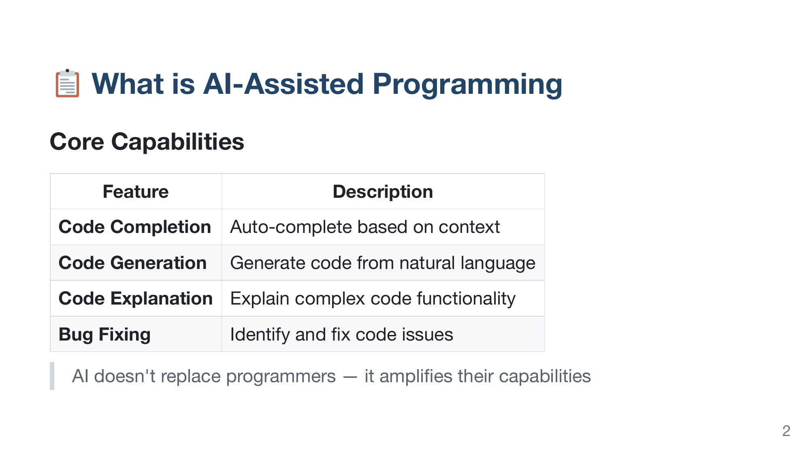

<h1 align="center">md-slides</h1>

<p align="center">
  <strong>A Claude Code skill for generating slides from Markdown</strong>
</p>

<p align="center">
  <a href="#installation">Install</a> •
  <a href="#usage">Usage</a> •
  <a href="#flavors">Flavors</a> •
  <a href="#visual-templates">Visual Templates</a> •
  <a href="https://zl190.github.io/md-slides/">Live Demo</a> •
  <a href="docs/presentation-showcase-zh.pdf">Showcase (PDF)</a>
</p>

<p align="center">
  
  
  
  
  
  
  
</p>

<p align="center">

</p>

---

## What is this?

A **Claude Code skill** that generates presentation slides from Markdown. Just describe what you want, or provide an existing `.md` file, and Claude will use proper tools to create the slides — including AI-generated diagrams and illustrations via [mcp-image](https://github.com/xkiranj/mcp-image).

<p align="center">

</p>

```bash
# In Claude Code:
/md-slides "Create a 5-slide presentation about Python async programming"
```

Claude will:
1. Use or Write the Markdown content
2. Generate diagrams/charts with AI (optional, requires mcp-image)
3. Choose the best tool (Marp, Beamer, etc.)
4. Generate PDF/PPTX/HTML output

## Installation

```bash
# Clone this repo
git clone https://github.com/zl190/md-slides.git

# The skill is in .claude/skills/md-slides/
# Claude Code auto-discovers skills in your project
```

## Usage

The skill uses natural language — just describe what you want:

```bash
# Generate from a topic
/md-slides "Create slides about machine learning basics"

# Convert existing markdown
/md-slides "Convert slides.md to PDF"

# With style preferences
/md-slides "Create slides about Q4 results, executive style, keep it brief"
```

## Flavors

Claude understands these style preferences:

| Flavor | Options | Default |
|--------|---------|---------|
| **audience** | `manager` · `developer` · `learner` · `general` | general |
| **style** | `professional` · `minimal` · `visual` · `academic` | professional |
| **language** | `en` · `zh` · `mixed` | en |
| **length** | `brief` (5-8) · `standard` (10-15) · `detailed` (20+) | standard |

### Examples

```bash
# Executive summary
/md-slides "Q4 results for management, brief and professional"

# Technical tutorial
/md-slides "Git branching tutorial for developers, detailed with code examples"

# Research presentation
/md-slides "ML research findings, academic style, bilingual"
```

## Visual Templates

**Visual templates** ensure consistent visual output (fonts, CSS, rendering). Without them, slides may render differently each time due to font variations or CSS inconsistencies.

Templates are in `.claude/skills/md-slides/templates/visual/`:

| Template | Language | Font Stack |
|----------|----------|------------|
| `default-en.md` | English | Noto Sans, Helvetica Neue |
| `default-zh.md` | Chinese | Noto Sans CJK SC, Microsoft YaHei |

<table>
<tr>
<th>Title Slide</th>
<th>Content Slide</th>
</tr>
<tr>
<td></td>
<td></td>
</tr>
</table>

<details>
<summary><strong>Chinese template example</strong></summary>

<table>
<tr>
<th>Title Slide</th>
<th>Content Slide</th>
</tr>
<tr>
<td></td>
<td></td>
</tr>
</table>

</details>

### How It Works

Claude automatically applies the appropriate visual template based on language. The template provides:
- Tested frontmatter (marp settings, theme, size)
- Consistent font stack for reliable rendering
- CSS that works across platforms

### Custom Looks

Add your own templates to `templates/visual/`:

```markdown
# My Corporate Look

\`\`\`yaml
---
marp: true
theme: gaia
style: |
  section { font-family: 'Corporate Font', sans-serif; }
  h1 { color: #company-blue; }
---
\`\`\`

## Rules
- Use frontmatter exactly as shown
- ...
```

See `templates/visual/README.md` for details.

## Supported Tools

The skill automatically selects the best tool:

| Tool | Formats | Best For |
|------|---------|----------|
| **[Marp](https://marp.app/)** | PDF, PPTX, HTML | General purpose (default) |
| **[Pandoc Beamer](https://pandoc.org/)** | PDF | Academic, math-heavy |
| **[python-pptx](https://python-pptx.readthedocs.io/)** | PPTX | Template-based, fine control |
| **[reveal.js](https://revealjs.com/)** | HTML | Web presentations |

> **Note:** Marp only requires Node.js (`npm install -g @marp-team/marp-cli`). Beamer requires a full LaTeX installation (`sudo apt install texlive-full` ~4GB).

## Visual Comparison

### Marp vs Beamer Output

<table>
<tr>
<th>Marp (Gaia Theme)</th>
<th>Beamer (Metropolis)</th>
</tr>
<tr>
<td></td>
<td></td>
</tr>
</table>

### Code & Math Rendering

<table>
<tr>
<th>Code (Marp)</th>
<th>Math (Beamer)</th>
</tr>
<tr>
<td></td>
<td></td>
</tr>
</table>

## AI Image Generation (Optional)

Generate diagrams, flowcharts, and illustrations for your slides using [mcp-image](https://github.com/xkiranj/mcp-image) (powered by Google Gemini).

<details>
<summary><strong>Setup mcp-image</strong></summary>

```bash
claude mcp add mcp-image \
  --env GEMINI_API_KEY=your-api-key \
  --env IMAGE_OUTPUT_DIR=/path/to/images \
  -- npx -y mcp-image
```

</details>

```bash
# Ask for slides with visuals
/md-slides "Create architecture slides with diagrams for our microservices system"
```

Claude will generate images like flowcharts, architecture diagrams, and timelines, then embed them in your slides.

## Manual Usage (without Claude)

If you want to use the tools directly:

<details>
<summary><strong>Marp CLI</strong></summary>

```bash
npm install -g @marp-team/marp-cli

marp slides.md -o slides.pdf
marp slides.md -o slides.pptx
marp slides.md -o slides.html
```

</details>

<details>
<summary><strong>Pandoc Beamer</strong></summary>

```bash
sudo apt install pandoc texlive-xetex

pandoc slides.md -t beamer --pdf-engine=xelatex -o slides.pdf
```

</details>

<details>
<summary><strong>reveal.js</strong></summary>

```bash
pandoc slides.md -t revealjs -s -o slides.html
```

</details>

## Project Structure

```
.claude/skills/md-slides/
├── SKILL.md                # The Claude Code skill
├── TOOLS.md                # Tool reference
└── templates/visual/        # Visual consistency templates
    ├── default-zh.md       # Chinese
    └── default-en.md       # English
docs/                       # Sample markdown & research
assets/                     # Comparison screenshots
```

## Research

This skill is based on research comparing 6 markdown-to-slides tools for LLM integration. See the [full report](docs/report-research-zh.md) (Chinese).

**Key finding:** Marp and python-pptx scored highest (24/25) for LLM integration due to simple CLI, text-based input, and clear error messages.

## License

MIT
