<h1 align="center">md-slides</h1>

<p align="center">
  <strong>A Claude Code skill for generating slides from Markdown</strong>
</p>

<p align="center">
  <a href="#installation">Install</a> •
  <a href="#usage">Usage</a> •
  <a href="#flavors">Flavors</a> •
  <a href="https://zl190.github.io/md-slides-tools/">Live Demo</a>
</p>

<p align="center">
  
  
  
  
</p>



```mermaid
flowchart LR
    A["📝 Markdown"] --> B["🤖 /md-slides"]
    B --> C["📊 PDF"]
    B --> D["📊 PPTX"]
    B --> E["🌐 HTML"]
```

---

## What is this?

A **Claude Code skill** that generates presentation slides from Markdown. Just describe what you want, and Claude creates the slides.

```bash
# In Claude Code:
/md-slides "Create a 5-slide presentation about Python async programming"
```

Claude will:
1. Write the Markdown content
2. Choose the best tool (Marp, Beamer, etc.)
3. Generate PDF/PPTX/HTML output

## Installation

```bash
# Clone this repo
git clone https://github.com/zl190/md-slides-tools.git

# The skill is in .claude/skills/md-slides/
# Claude Code auto-discovers skills in your project
```

## Usage

### Basic

```bash
/md-slides "Create slides about machine learning basics"
```

### With Flavors

```bash
/md-slides "Create slides about our Q4 results" --audience manager --style professional
```

### Specify Output

```bash
/md-slides "Tutorial on Git branching" --format pptx
```

## Flavors

Customize your slides with these parameters:

| Flavor | Options | Default |
|--------|---------|---------|
| **audience** | `manager` · `developer` · `learner` · `general` | general |
| **style** | `professional` · `minimal` · `visual` · `academic` | professional |
| **language** | `en` · `zh` · `mixed` | en |
| **length** | `brief` (5-8) · `standard` (10-15) · `detailed` (20+) | standard |

### Example Combinations

| Use Case | Flavors |
|----------|---------|
| Executive summary | `--audience manager --style professional --length brief` |
| Technical tutorial | `--audience developer --style minimal --length detailed` |
| Research presentation | `--audience general --style academic --language mixed` |

## Supported Tools

The skill automatically selects the best tool:

| Tool | Formats | Best For |
|------|---------|----------|
| **[Marp](https://marp.app/)** | PDF, PPTX, HTML | General purpose (default) |
| **[Pandoc Beamer](https://pandoc.org/)** | PDF | Academic, math-heavy |
| **[python-pptx](https://python-pptx.readthedocs.io/)** | PPTX | Template-based, fine control |
| **[reveal.js](https://revealjs.com/)** | HTML | Web presentations |

## Visual Comparison

### Marp vs Beamer Output

<table>
<tr>
<th>Marp (Gaia Theme)</th>
<th>Beamer (Metropolis)</th>
</tr>
<tr>
<td></td>
<td></td>
</tr>
</table>

### Code & Math Rendering

<table>
<tr>
<th>Code (Marp)</th>
<th>Math (Beamer)</th>
</tr>
<tr>
<td></td>
<td></td>
</tr>
</table>

## Manual Usage (without Claude)

If you want to use the tools directly:

<details>
<summary><strong>Marp CLI</strong></summary>

```bash
npm install -g @marp-team/marp-cli

marp slides.md -o slides.pdf
marp slides.md -o slides.pptx
marp slides.md -o slides.html
```

</details>

<details>
<summary><strong>Pandoc Beamer</strong></summary>

```bash
sudo apt install pandoc texlive-xetex

pandoc slides.md -t beamer --pdf-engine=xelatex -o slides.pdf
```

</details>

<details>
<summary><strong>reveal.js</strong></summary>

```bash
pandoc slides.md -t revealjs -s -o slides.html
```

</details>

## Project Structure

```
.claude/skills/md-slides/   # The Claude Code skill
docs/                       # Sample markdown & research
samples/                    # Code examples
assets/                     # Comparison screenshots
```

## Research

This skill is based on research comparing 6 markdown-to-slides tools for LLM integration. See the [full report](docs/report-research-zh.md) (Chinese).

**Key finding:** Marp and python-pptx scored highest (24/25) for LLM integration due to simple CLI, text-based input, and clear error messages.

## License

MIT
