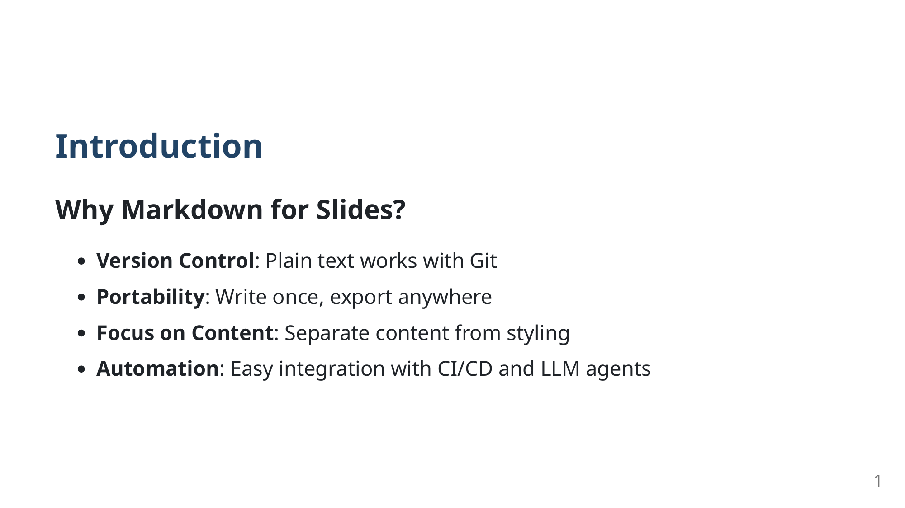
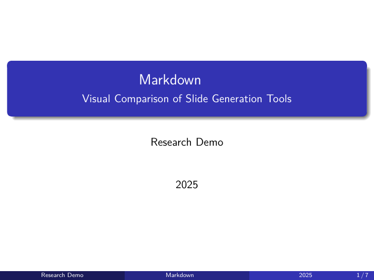
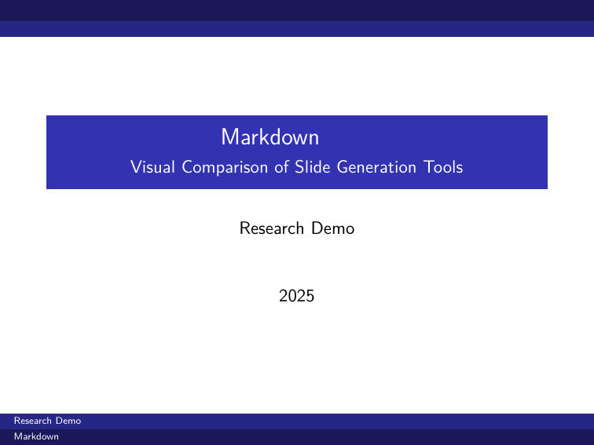

<!-- _class: lead -->

# Markdown 幻灯片工具研究报告

**研究目标**: 对比分析主流工具的视觉效果与 LLM 智能体集成能力

研究员: zl190
日期: 2026

---

# 研究背景

## 为什么使用 Markdown 生成幻灯片？

- **版本控制友好** - 纯文本与 Git 完美兼容
- **内容与样式分离** - 专注内容创作
- **自动化潜力** - 易于集成 CI/CD 和 LLM 智能体工作流

---

# Markdown：通用源格式

## 一次编写，多处输出

<div class="flow-diagram">
<div class="flow-box source">slides.md</div>
<span class="flow-arrow">→</span>
<div class="flow-box">转换工具</div>
<span class="flow-arrow">→</span>
<div class="flow-box output">PDF / PPTX / HTML</div>
</div>

| 输出格式 | 用途 | 推荐工具 |
|----------|------|----------|
| **PDF** | 演示、打印、归档 | Marp, Beamer |
| **PPTX** | 分享、协作编辑 | Pandoc, python-pptx |
| **HTML** | Web 发布、交互式 | reveal.js, Slidev |

**核心理念**: 内容与格式分离，一份源文件适配多种场景

---

<!-- _class: lead -->

# 幻灯片构成解析

**理解 PPTX 的组成元素**

---

# 幻灯片的六大组成元素

<div class="anatomy-grid">
<div class="anatomy-item">
<div class="icon">T</div>
<div class="label">文本 Text</div>
<div class="desc">标题、正文、列表</div>
<div class="difficulty easy">易于生成</div>
</div>
<div class="anatomy-item">
<div class="icon">▦</div>
<div class="label">布局 Layout</div>
<div class="desc">模板、占位符</div>
<div class="difficulty medium">中等难度</div>
</div>
<div class="anatomy-item">
<div class="icon">◐</div>
<div class="label">图片 Image</div>
<div class="desc">照片、图表、图标</div>
<div class="difficulty medium">中等难度</div>
</div>
<div class="anatomy-item">
<div class="icon">▢</div>
<div class="label">形状 Shape</div>
<div class="desc">矩形、箭头、标注</div>
<div class="difficulty hard">较难控制</div>
</div>
<div class="anatomy-item">
<div class="icon">⊞</div>
<div class="label">表格 Table</div>
<div class="desc">数据网格</div>
<div class="difficulty easy">易于生成</div>
</div>
<div class="anatomy-item">
<div class="icon">▶</div>
<div class="label">动画 Animation</div>
<div class="desc">过渡、构建效果</div>
<div class="difficulty hard">很难控制</div>
</div>
</div>

---

# 各工具元素支持度

| 元素 | Marp | Pandoc | python-pptx | reveal.js |
|------|:----:|:------:|:-----------:|:---------:|
| 文本 Text | ✓ | ✓ | ✓ | ✓ |
| 布局 Layout | ✓ | ✓ | ✓✓ | ✓ |
| 图片 Image | ✓ | ✓ | ✓✓ | ✓ |
| 形状 Shape | - | - | ✓✓ | ✓ |
| 表格 Table | ✓ | ✓ | ✓✓ | ✓ |
| 动画 Animation | - | - | ✓ | ✓✓ |

**说明**: ✓ = 支持, ✓✓ = 完全控制, - = 不支持

**结论**: python-pptx 元素控制最全面，Marp 覆盖常用场景

---

# 测试工具概览

| 工具 | 主要输出 | 依赖复杂度 |
|------|----------|------------|
| **Marp** | PDF, PPTX, HTML | 低 (npm) |
| **Pandoc + Beamer** | PDF | 高 (LaTeX) |
| **Pandoc PPTX** | PPTX | 低 |
| **reveal.js** | HTML | 低 |
| **python-pptx** | PPTX | 低 (pip) |

---

# 视觉效果对比：封面页

## Marp (默认) vs Beamer (Metropolis)

<div class="comparison">
<div>

<p><strong>Marp 默认主题</strong></p>
</div>
<div>

<p><strong>Beamer Metropolis</strong></p>
</div>
</div>

---

# 视觉效果对比：Marp 主题

## 默认 vs Gaia

<div class="comparison">
<div>

<p><strong>默认主题</strong></p>
</div>
<div>

<p><strong>Gaia 主题</strong></p>
</div>
</div>

---

# 视觉效果对比：Beamer 主题

## Metropolis / Madrid / Berlin

<div class="triple">
<div>

<p>Metropolis</p>
</div>
<div>

<p>Madrid</p>
</div>
<div>

<p>Berlin</p>
</div>
</div>

---

# 代码高亮对比

## Marp vs Beamer

<div class="comparison">
<div>

<p><strong>Marp</strong> - 现代高亮</p>
</div>
<div>

<p><strong>Beamer</strong> - LaTeX 风格</p>
</div>
</div>

---

# 数学公式对比

## Marp vs Beamer

<div class="comparison">
<div>

<p><strong>Marp</strong> - MathJax 渲染</p>
</div>
<div>

<p><strong>Beamer</strong> - LaTeX 原生</p>
</div>
</div>

---

# 输出文件大小对比

| 工具/格式 | 文件大小 |
|-----------|----------|
| Marp PDF (默认) | 88 KB |
| Marp PPTX | 683 KB |
| Pandoc Beamer (Metropolis) | 36 KB |
| Pandoc PPTX | 35 KB |
| python-pptx | 29 KB |

**结论**: Beamer PDF 最小，Marp PPTX 较大（嵌入资源）

---

<!-- _class: lead -->

# LLM 智能体集成能力分析

**核心问题**: 哪个工具最适合 AI 驱动的自动化工作流？

---

# LLM 集成评估维度

1. **纯文本输入** - LLM 能否直接生成源文件
2. **CLI/API 可调用性** - 命令行友好程度
3. **模板灵活性** - 样式定制能力
4. **错误处理清晰度** - 便于 LLM 自我修正
5. **增量编辑** - 能否单独修改某一页

---

# LLM 智能体集成评分

| 工具 | 文本 | CLI | 模板 | 错误 | 增量 | **总分** |
|------|:----:|:---:|:----:|:----:|:----:|:--------:|
| **Marp** | 5 | 5 | 4 | 5 | 5 | **24/25** |
| **python-pptx** | 5 | 5 | 5 | 4 | 5 | **24/25** |
| **reveal.js** | 5 | 4 | 5 | 4 | 5 | **23/25** |
| **Slidev** | 5 | 3 | 4 | 4 | 5 | **21/25** |
| **Pandoc Beamer** | 5 | 5 | 4 | 2 | 4 | **20/25** |
| **Pandoc PPTX** | 5 | 5 | 3 | 4 | 3 | **20/25** |

---

# 为什么 Marp 适合 LLM 智能体？

## 关键优势

- **单一命令多格式输出**
  ```bash
  marp slides.md -o output.{pdf,pptx,html}
  ```

- **格式自动检测** - 通过文件扩展名判断

- **清晰的错误日志** - `[INFO]` 和 `[ERROR]` 前缀

- **无交互式提示** - 完全自动化友好

---

# LLM 工作流示例：Marp

```python
# LLM 生成 Markdown 内容
content = llm.generate("创建关于机器学习的5页幻灯片")

# 写入文件
with open("slides.md", "w") as f:
    f.write("---\nmarp: true\n---\n\n" + content)

# 生成输出 (单行命令)
subprocess.run(["marp", "slides.md", "-o", "slides.pdf"])
```

**优势**: 简单、统一、可靠

---

# python-pptx：精细控制方案

```python
from pptx import Presentation

prs = Presentation("template.pptx")  # 企业模板

# LLM 生成结构化数据
for slide_data in llm.generate_structured():
    slide = prs.slides.add_slide(prs.slide_layouts[1])
    slide.shapes.title.text = slide_data["title"]
    # 精确控制每个元素...

prs.save("output.pptx")
```

**适用**: 需要企业模板、精细样式控制的场景

---

# Pandoc Beamer 的局限性

## 对 LLM 不友好的原因

```
! LaTeX Error: Unicode character 幻 (U+5E7B)
  not set up for use with LaTeX.
```

- LaTeX 错误信息晦涩难懂
- CJK 字符需要额外配置
- 需要安装 TeX 发行版 (体积大)
- LLM 难以自动修正错误

---

# 场景推荐矩阵

| 使用场景 | 首选工具 | 理由 |
|----------|----------|------|
| **LLM 自动生成** | Marp | CLI 简单，错误清晰 |
| **可编辑 PPTX** | python-pptx | 完全控制，企业模板 |
| **学术论文配套** | Pandoc Beamer | LaTeX 数学公式 |
| **Web 演示** | reveal.js | 动画效果，响应式 |
| **开发者分享** | Slidev | 代码演示，热重载 |

---

# 推荐的 LLM 工作流方案

## 方案 A：Marp 流水线（推荐）

```
LLM 生成内容 → Markdown → Marp CLI → PDF/PPTX/HTML
```

## 方案 B：python-pptx 直接生成

```
LLM 生成结构化数据 → Python 脚本 → PPTX
```

## 方案 C：混合方案

```
LLM → Marp → PDF（演示用）
    ↘ Pandoc → PPTX（分享编辑用）
```

---

<!-- _class: lead -->

# 结论与建议

---

# 核心发现

1. **Marp 与 python-pptx 并列最佳（24/25 分）**
   - Marp：多格式输出，Markdown 友好
   - python-pptx：LLM 直接生成代码，完全控制

2. **选择依据：输出需求**
   - 需要 PDF/HTML → Marp
   - 需要精细 PPTX 控制 → python-pptx

3. **Pandoc Beamer 适合学术场景**
   - 排版质量最高，但对 LLM 不友好

---

# 最终推荐

| 优先级 | 工具 | 使用场景 |
|:------:|------|----------|
| **1** | Marp | 多格式输出，Markdown 工作流 |
| **1** | python-pptx | 精细 PPTX 控制，企业模板 |
| **2** | Pandoc PPTX | 轻量可编辑 PPTX |
| **3** | reveal.js | Web 演示 |

---

# 下一步行动

1. **建立标准工作流** - 基于 Marp 的 LLM 幻灯片生成流水线

2. **模板库建设** - 创建符合团队风格的 Marp/PPTX 模板

3. **集成测试** - 在实际 LLM 智能体项目中验证

---

<!-- _class: lead -->

# 谢谢！

**问题与讨论？**

---

# 附录：快速开始

```bash
# 安装 Marp (推荐)
npm install -g @marp-team/marp-cli

# 生成 PDF
marp slides.md -o slides.pdf

# 生成 PPTX
marp slides.md -o slides.pptx

# 生成 HTML
marp slides.md -o slides.html
```

详细报告: `report-research-zh.md`
